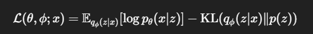
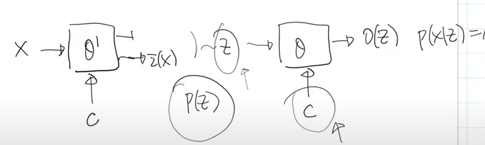

# Autoencoder
## 作業
第一題:影片29:31、30:20、40:20
第二題:影片49:00、53:00、:1:49:00(看論文)https://arxiv.org/abs/1511.05644、2:05:00(這段極度重要)疑似使用蒙地卡羅，
## 介紹
使用encoder、decoder架構，將input轉換為output，而input與output越像越好，目的使望透過encoder降低輸入維度，並透過decoder將其還原。
## VAE
Variational Autoencoder，與傳統autoencoder不同的是，VAE的encoder會將輸入轉換為一個分布，可以在生成過程中引入隨機性。
詳細解釋流程:
encoder會輸出兩個值，μ(x), σ(x)，μ(x)代表平均，μ(x)代表標準差，這兩個值帶入高斯分布公式，用來生成一個高斯分布q(z|x)。
decoder會從這個分布中隨機抽取一個z，然後將z帶入decoder中，生成一個重建的輸出x̂。

```

輸入圖像 x
   ↓
Encoder（神經網路）
   → 輸出 μ(x), σ(x)
   → 表示 q(z|x) = N(μ, σ²)
   ↓
從 q(z|x) 抽一個 z（Reparameterization）
   ↓
Decoder（神經網路）
   ↓
重建輸出 x̂

```

### KL Divergence
KL Divergence是用來衡量兩個分布之間的差異，VAE中使用KL Divergence來衡量q(z|x)與p(z)之間的差異，這樣可以讓生成的z更接近於p(z)，從而使生成的樣本更真實。
（VAE）中，我們的訓練目標是最大化下列的 Evidence Lower Bound (ELBO):


### reparameterization trick
### monte carlo

## conditional VAE
conditional VAE是VAE的一個變種，它在encoder和decoder中都引入了條件變量c，這樣可以使生成的樣本更符合條件c。
