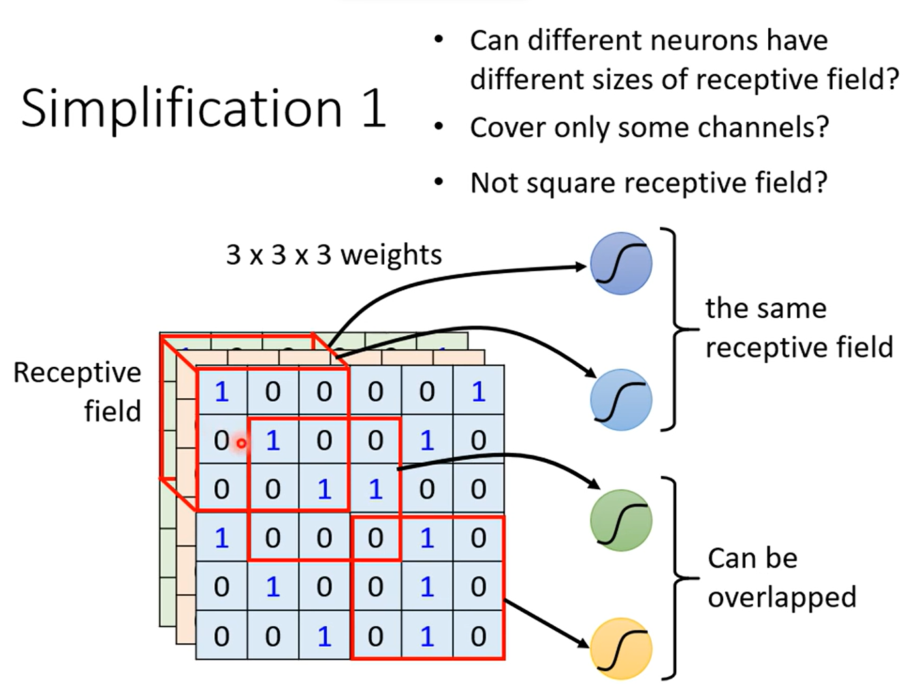

# CNN

# CNN (Convolutional Neural Network)

## 1.R**eceptive field**

**receptive field** 是一格n*n*n矩陣，resceptive fiend 可重疊，可相等

**kernal size**=n*n(只考慮一個channel)

一個resceptive field 通常會用多個neural來處理，

**stride**代表每個resceptive fiend 和下一個之間的移動量。通常不會設太高，會讓兩隔resceptive field之間有重疊，若移動至邊界超出圖片則做padding(ex:空值補0，或補整張圖數值頻均，有許多做法)

## 2.Paraneter share

皆是進行特定特徵的判斷，所以影像辨識可以共享參數，(如左圖的兩個神垧架構，右邊的共用filter)

上圖左右意思相等，左邊wieght等於右圖filter

## 3.Pooling

pooling做減少運算量使用，在執行一次卷積後抓取n*n，並取其中某特徵保留進入下一層

ex:max pooling

由於運算能力增強，逐漸開始減少使用pooling以免影響模型表現。

## 小結

---

CNN為針對影像辨識進行限制(resceptive field，parameter share)s的fully connected layer雖然model bias變大，model fiexibility小，但因為是針對影像的特性進行限制，有助於提升影像辨識的效率及準確率，對於其他辨識沒有好處