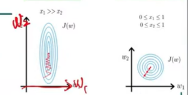
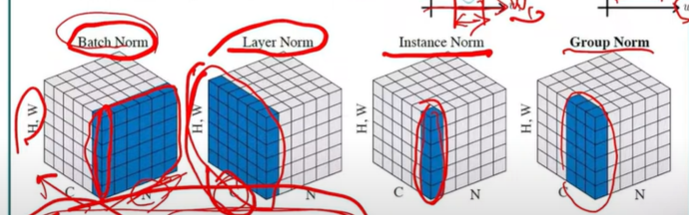
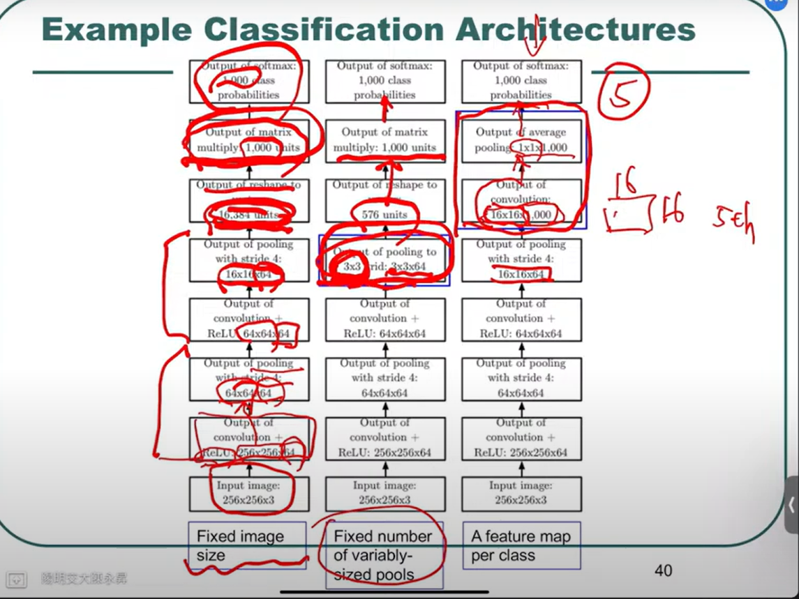
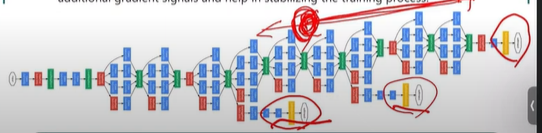
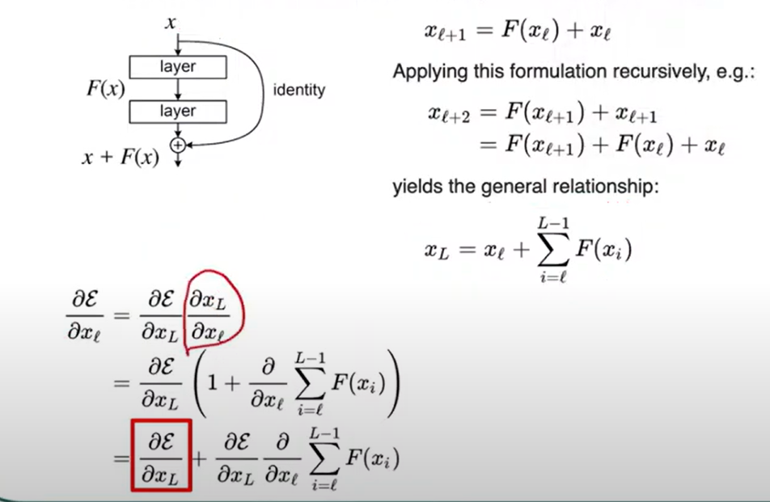
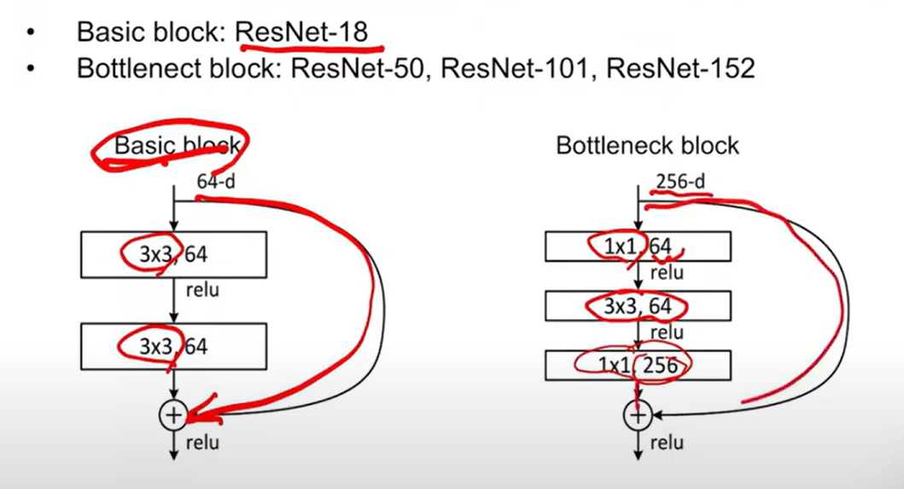
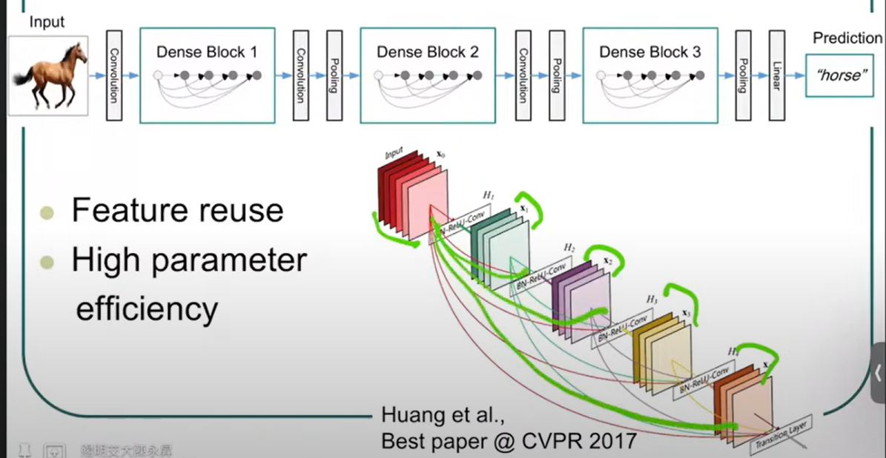
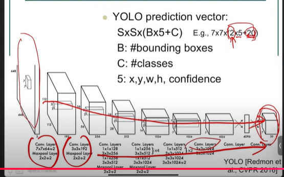
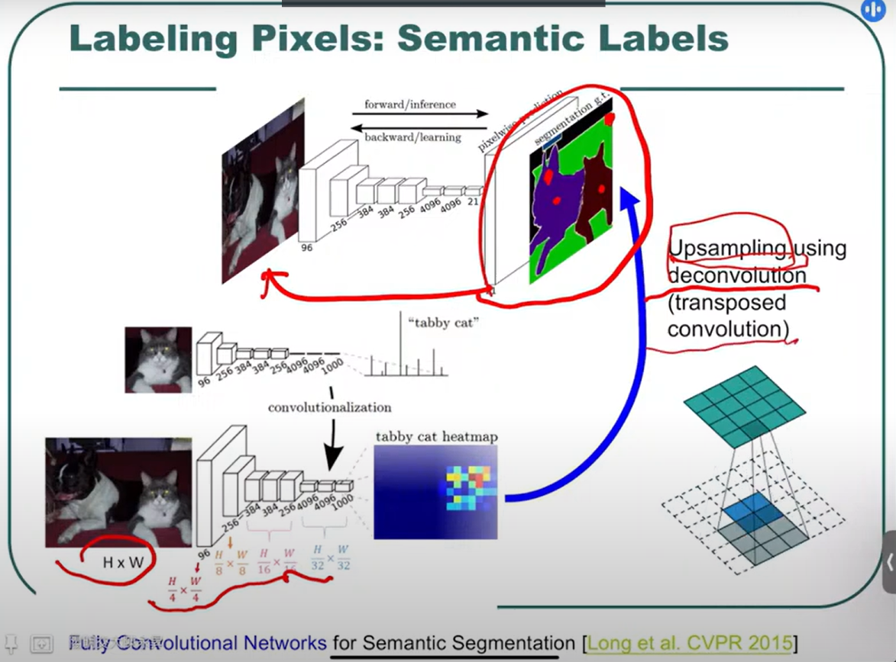

 # CNN
 ## CNN特點
 1. kernel大小小於input，相比於全連接，可以大量減少計算
 2. local connectivity，局部連接，一個pixel的資訊只會影響區域的計算，這樣可以減少參數量，在透過疊層的方式來加強全域的連接性
   
   
3. 若該層cnn kernel 為3X3，只需最佳化找出9個參數
### tiled convolution
根據位置不同，使用不同的kernel，可參考圖中，一般cnn使用ababab重複的參數，而tiled convolution則是使用不同的參數abcd

### dilated convolution
在kernel中間加上空格，這樣可以增加感受野，讓網路能夠學習到更大的範圍，且不增加計算量

## cnn各層用意
### pooling
1.pooling 可以強化cnn靈活性，針對位置不同、部分旋轉的物件都能夠辨識
1. stride=2，pooling後的大小會變成原本的1/4(2X2合一)
### padding
由於每次卷積後，資料變小，為了避免資料減少，

可以在邊界加上padding，讓資料不會變小，如:zeros padding，將邊界加上0，這樣卷積後資料大小不會變小

### normalization
#### why normalization?
normalization可以讓網路更快收斂，將資料進行從新分布，讓資料的分布更平均，如右圖。

#### normalize 方法
normalization 有很多方法，不只batch normalization，只是通常使用batch normalization，因為它的效果最好。
1. batch normalization
2. layer normalization 
3. instance normalization
4. group normalization

### architecture of CNN

可以設定convolution為3*3*1000，其中1000代表會有1000個kernel
最後右一個網路架構可以實現視覺化，因為可以追溯到16*16*1000那層，若辨識結果為第五類，可以觀察5th(in 1000)kernel，知道這個kernel是針對什麼特徵進行辨識的。

### initialization of kernel(weight)
three ways:
1. random initialization(performs very  well)
2. learbed with unsupervised criterion
3. disinged by hand

## famous CNN
### AlexNet
AlexNet是第一個使用GPU來進行訓練的網路，使用了5層的convolution layer和3層的fully connected layer，並且使用了ReLU作為activation function。

### GoogLeNet
網路深度高，googlenet使用了
1. inception module
   同時使用不同大小的kernel，ex:1*1,3*3,5*5，這樣可以讓網路學習到不同大小的特徵，並且將這些特徵進行結合。
2. dimension reduction
   在inception module中，使用1*1的kernel來進行維度的減少，這樣可以減少計算量。
3. auxiliary classifier
   由於網路深度高，再不同層級加入classifier，可以避免梯度消失的問題。
   
### ResNet
resNet的層數高，引入了skip connection機制，將前幾層的輸出直接加到後面的層。該機制再進行back propagation時，會將梯度直接傳遞到前幾層，這樣可以避免梯度消失的問題。
如下圖，梯度的計算是紅色方框加上後方式子，引此即使後方梯度小，也能透過方框的值向前傳遞。

不同級別的resnet，resnet50, resnet101, resnet152，會使用basic block和bottleneck block，兩個block的差別在於bottleneck block會使用1*1的kernel來進行維度的減少，再重新conv補回輸入的大小。

### DenseNet
如人腦對於影像辨識會有不同分區，每區在產生結果時也會交互影響
densenet的架構會將cnn堆疊成一組，而每組的輸出會在傳入下方各組，因此可以同時參考low level、high level的特徵。

### unet
unet 可以做到segmentation，將每個pixel進行分類，這樣可以分類物體並描繪出邊緣。
使用skip link 的方式，將進行encoder時的特徵細節傳遞到decoder，這樣有助於pixel的分類。 
## training skills
1. crop image
   通常影像會大於網路的輸入大小，引此可以使用剪裁方式，使用原比例進行剪裁，不一定要使用resize。
2. CNN的kernel size可以小一點，ex:3*3，再多疊幾層，這樣可以減少計算量，且不會影響結果。(AlexNet(11*11) vs VGGNet(3*3)win)
## more application about CNN
### object detection
1. R-CNN(region-based CNN)
   將圖片分區，一張圖片可能分成2000區域，每個區域都會使用CNN進行辨識。
2. Fast R-CNN
   R-CNN會分隔圖片到2000張，但彼此重疊，FastCNN避免重複計算重疊的區域，比較快。R-CNN分割圖片方法使用舊式方法
，Fast R-CNN透過Feature map來進行分割，這樣可以減少計算量。但也因此，網路會分為兩個部分，第一個部分是將圖片進行分割，第二個部分是將分割後的圖片進行辨識。

3. YOLO(You Only Look Once)
   YOLO會將圖片分成S*S的grid，每個grid會使用CNN進行辨識，每個grid會分別辨識其bounding box 、classes vector x,y,w,h,confidence score。
   

### segmentation
基於pixel的分類，將每個pixel進行分類，這樣可以分類物體並描繪出邊緣。
在cnn進行特徵擷取後必須要透過upsampling來進行上採樣，這樣可以將模型輸出變成原本的大小。
 
### regression
人體骨架偵測
### similarity measure
分辨物體的相似度，ex:辨識兩張圖片是否為同一個人
### visual tracking
物體追蹤，透過CNN來進行物體的追蹤
### image generation
給定類別，生成該類別的圖片
### restoration/enhancement
影像增強，模糊變清晰

   

