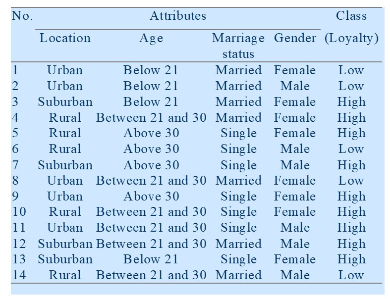
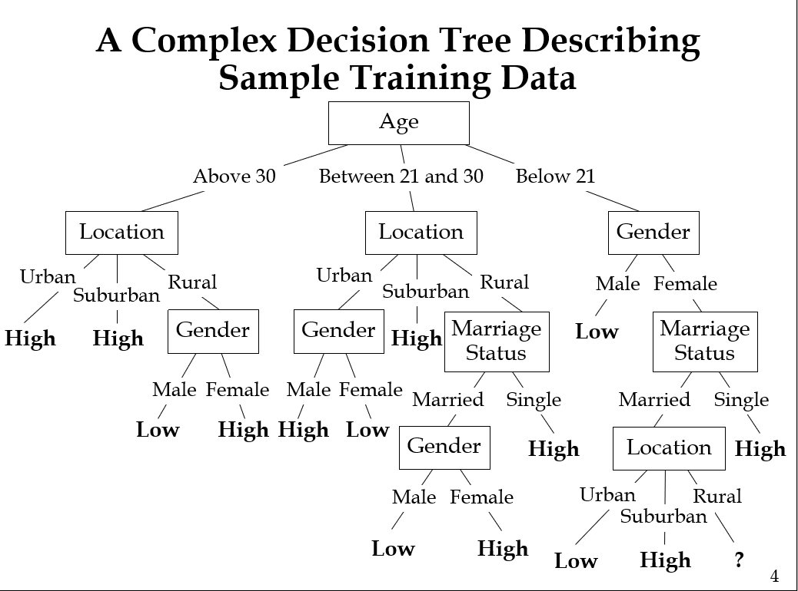
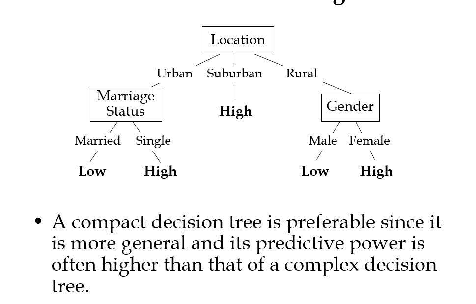
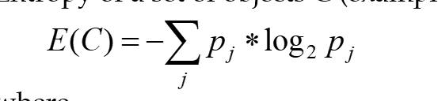
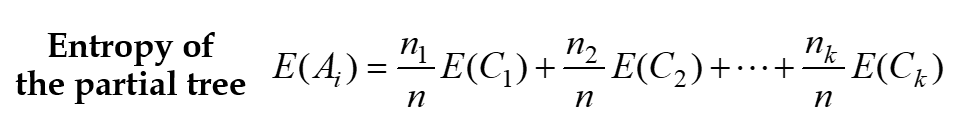
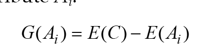
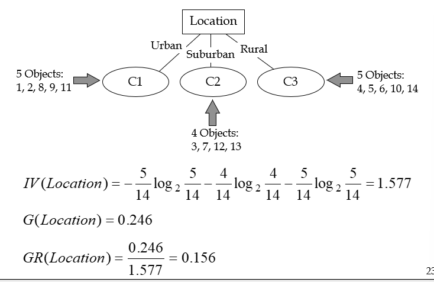
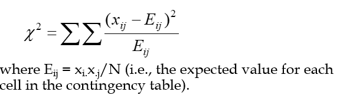
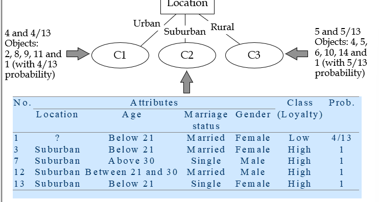

# decision tree
## row data

## tree 架構

過複雜，普遍性低，預測能力差

分類簡單，普遍性高，預測能力強
## ID3
### Entropy function 

example:
j=high function=7/14*log2(7/14)=-1/2
j=low function=7/14*log2(7/14)=-1/2
Entropy=-(1/2+1/2)=1**最亂狀態**

j=high function=14/14*log2(14/14)=0
j=low function=0/14*log2(0/14)=0
Entropy=-(0+0)=0**最整齊狀態**

### Entropy of partal tree

針對節點的資料量做加權平均，衡量該以該特徵分類的亂度

### Information Gain
考慮母體的狀態，選擇亂度最小的

Gain(C)=母體狀態Entropy-子集狀態Entropy總和

### Gain Ratio
考慮特徵的分類能力，將可區分最多資料的給予最高

### chi-square卡方檢定

當某屬性可將分類資料區分的很好，則其卡方值會很大，反之則很小

### Unknow attribute
遇到缺失資料的處理方式
1. ingore:刪除該筆資料
2. impute:補值，取平均值或是眾數
3. assign:將缺失值視為一個新的分類，自成一類
#### Unknow attribute in decision tree(C4.5)
若遇到缺失值，則將該筆資料分配到每一分類。

### pruning
剪枝，刪除不可靠分支，雖提高training  data loss，
但提高testing data預測能力，因為只保留重要的分支
### 剪枝方法
1. critical value:設定一個門檻值，當分支的gain值低於門檻值時，停止分支
2. Error-complexity pruning:使用training data建構樹，逐步剪枝，選擇可在testing data上有最佳預測能力的分支。
3. Minium-error pruning:
