# lesson 2
## gradient 梯度
### 何謂梯度
他其實就是斜率！
差別在於，當我們的函數只接受一個變數作為輸入的時候，我們會說斜率，他比較像是在一條直直的溜滑梯上，方向是固定的，當函數可以有多個變數的時候，我們會說梯度，他就像是在一個開放的山丘上，可以有不同的方向。
## output layer 輸出層
### linear

### sigmoid
用於進行二元分類，對比y=1與y=0的機率
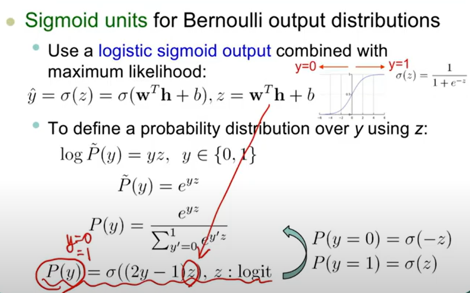
### softmax
softplus function(綠線)，平滑版的relu，將數值轉換為0以上的數值，如機率，但無法縮小gradient
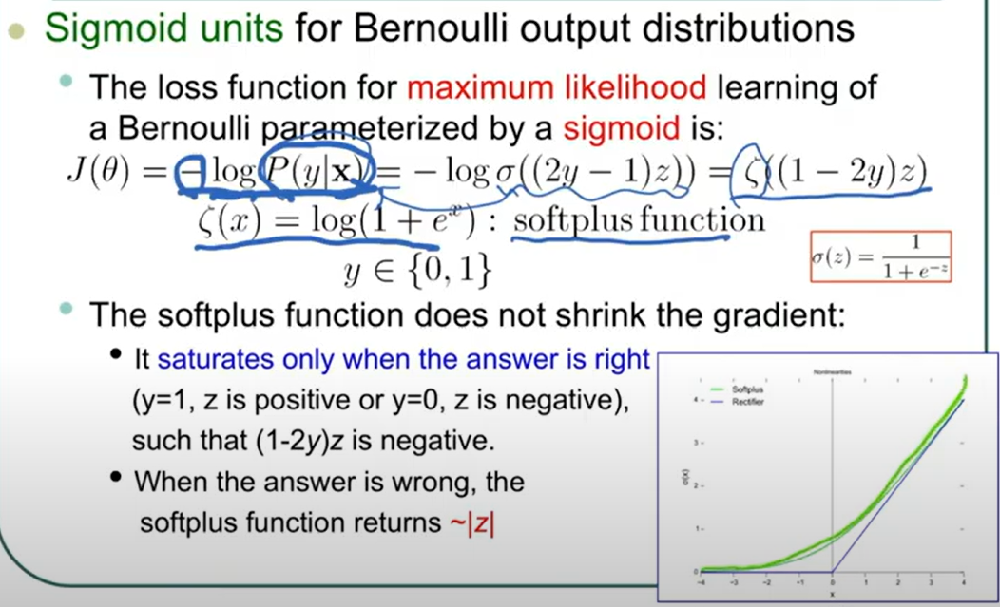

softmax function，用於多元分類，將input數值轉換為機率分布，
softmax function是sigmoid function的延伸，用sigma計算所有輸出的數值，並且將他們標準化，讓他們的總和為1。
因此當n=2時，softmax function就是sigmoid function
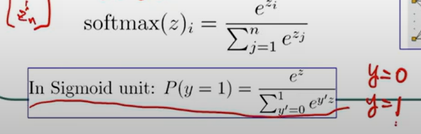
softmax function transform the output into probability
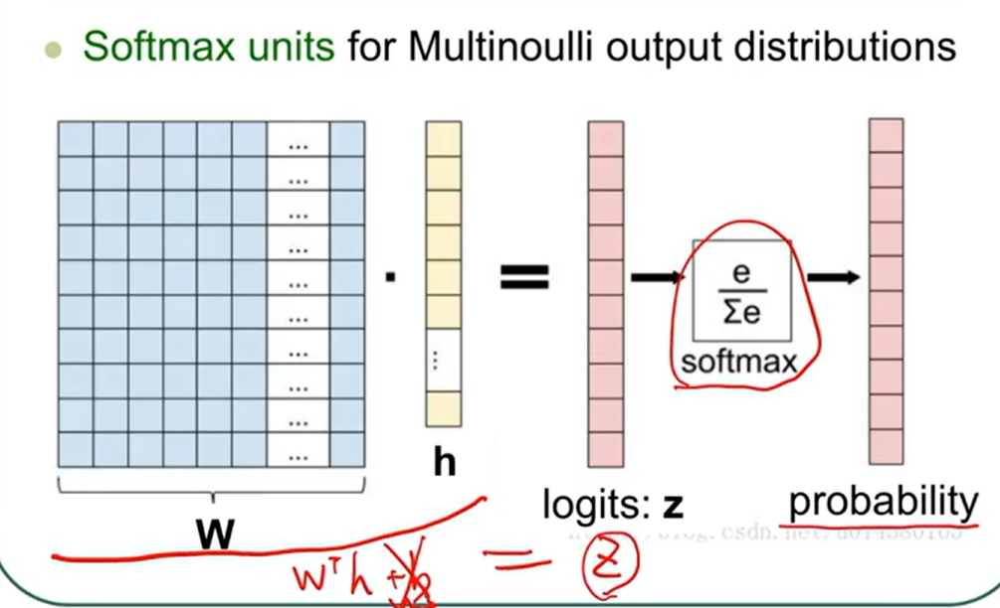

## hidden layer 隱藏層
### ReLU
ReLU不可微，但是可以用subgradient來解決
ReLU是最常用的activation function，他的可微性不是很重要，因為他的梯度在x=0的時候是不定的，但是在其他地方是固定的，梯度0或1。

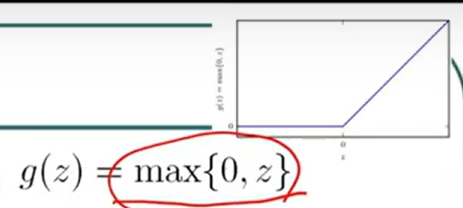
ReLU初始化時適合設置b為小正數，避免一開始落入1不連續(x=0)的地方
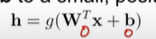
ReLU缺點是當x<0時，梯度為0，這個神經元就會永遠不會被激活，dying ReLU problem

不同的ReLU變形，如Leaky ReLU，處理負數梯度問題
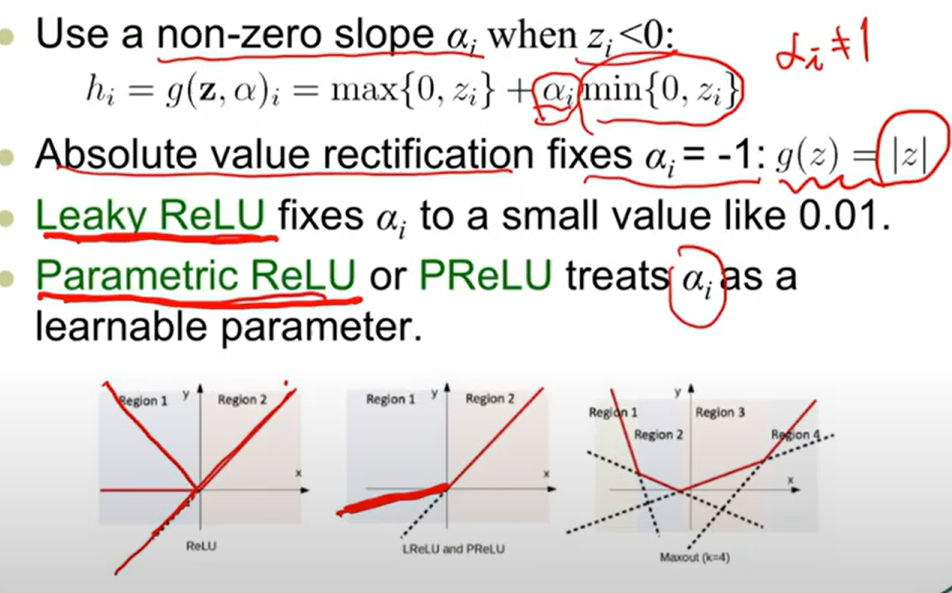

### Maxout
Maxout是ReLU的延伸，透過sigma計算k個linear，取最大值，分段線性
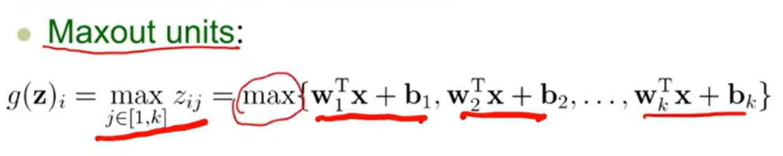
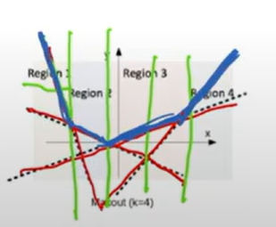
當k=2，w1=b1=0時，Maxout就是ReLU
Maxout效果更好，但必須使用更多training data，因為有更多參數，否則使用ReLU
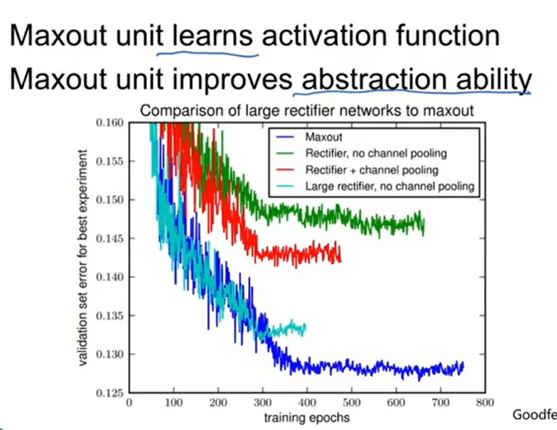

## network structure 網路結構
只使用單層hidden layer的神經網路，其實可以解決任何問題，
但是需要很多很多的神經元，這樣的網路稱為universal approximator，這樣的網路很難訓練，
因此我們通常會使用更多層的網路，減少每層的神經元數量。

圖片可以說明為什麼需要更多層的網路，
單層時區分兩個種類需要複雜的線，但經過兩次摺疊
，就可以用簡單的線來區分，依次折疊代表網路的層數
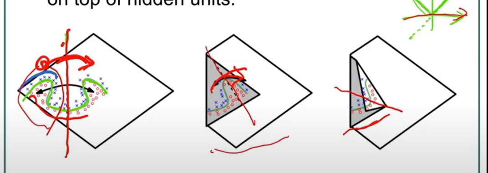

透過這張圖可以發現，相同參數量，多層網路的效果比單層網路好，
而相同層數，多參數量的網路效果不一定比較好
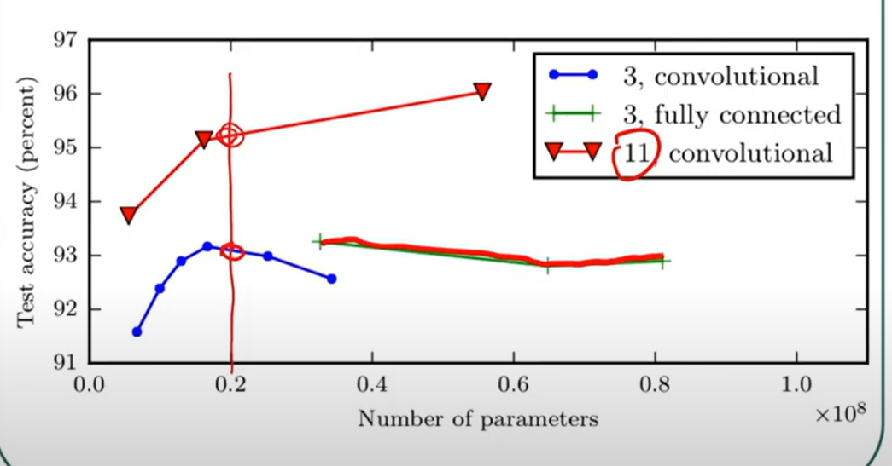

## backpropagation 反向傳播
