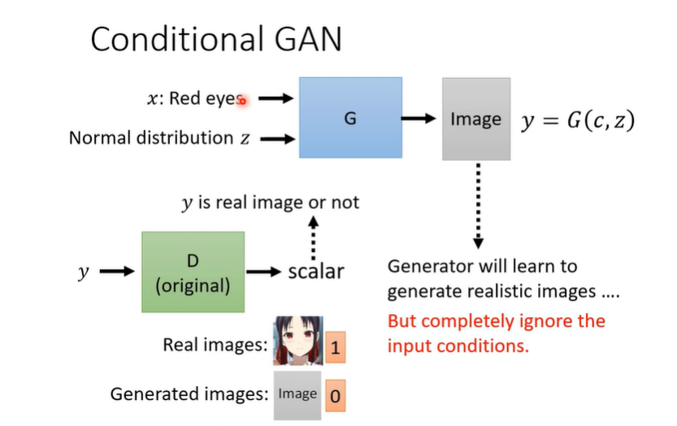

# GAN
## 介紹
全名generative adversarial network
### generator
輸入 neural network 的除 $x$ 以外，還有一個從某一簡單的（已知）分布中隨機採樣得到的一個 random 的 variable，其中這個  neural network 就是 generator

### discriminator
input :image
output : probability
意義:一個神經網路用來評價一個輸入的圖片效果有多好

### 整體概念
generator負責生成圖片
discriminator負責評價圖片
在訓練的過程中，generator會越來越會生成圖片，discriminator會越來越會評價圖片

## 訓練過程
### step1

1. 故定generator(初始化參數)後，使用gentrator生成圖片(效果肯定非常差)
2. 使用gentrator生成的圖片與真正資料集中的圖片訓練discriminator(一個classifier or regressor)，分辨這是真實的還是生成的
### step2

1. 固定discriminator，訓練generator，使得discriminator無法分辨出生成的圖片
2. 可將discriminator與generator視為一個大神經網路，在這一步驟中，該網路不能更改後方discriminator的參數，只能更改前方generator的參數
### tip
根據上課素材的二次元人物，訓練2萬次後效果較好
GAN很不好train
相關技巧文獻

## 實際理論
- 目的:透過generator生成一個分布(distribution)，使得這個分布與真實分布盡可能相似
loss計算:透過divergence(散度)來衡量兩個分布的相似程度

- 問題: 無法完整得到distribution，因此無法衡量兩個distribution的divergence
- 解法: 使用discriminator，以Sample方式分辨生成與真實的圖片

- 事實上:objective function是cross entropy乘以負號
- 進一步思考:為何可以透過sample的圖片推導期distribution的近似度?(paper有寫推導)
- 根據上面問題改良後，generator目的為最小化maxV(G,D)，而maxV(G,D)為discriminator
- 
## GAN困難點與演化
### 困難點
- 將圖片想像為一個高維度空間，要在這個空間中構成一張合理的圖片的機率極低，因此要訓練到分布與真實分布相似是非常困難的
- 我們僅能透過sample的圖片來推導分布，但若spmple的圖片不夠多，則無法觀測其重疊部分(sample太少可能都取到不重疊部分)
- 我們使用js divergence來衡量兩個分布的相似度，但該方法再兩個分布不重疊時所算出的值皆為log2，無論兩個分布距離極度相近或是距離很遠，導致難以收斂
- 若discriminator以classification的方式來判斷，很容易發現其accuracy為100%，因為sample的圖片太少，discriminator可以直接硬記下所有的種類

#### WGAN
- 針對JS divergence的問題，提出了Wasserstein GAN
- Wasserstein 可以有效兩個分布的相似度，即使兩個分布不重疊
- Wasserstein ，以推土方式想像，該算法便是計算如何將生成的分布堆為真實分布，計算距離(可能有很多種方法，但只要最小值)
  
  
##### 算法
計算該Function，其功能為，讓EX在真實圖片中可以取得較大值，生成圖片中可以取得較小值，但有一限制為，D(x)的Function需是1-Lipschitz(簡單函式)

#### SNGAN (special normalization)
可以有效設計1-Lipschitz的函式，詳情請見paper(該方法效果不錯)

## 如何評估生成的圖片
 - 人為判斷(不穩定、不公正)
 - image classifier，透過影像辨識模型來判斷，有辦法辨認，代表效果越好
  - mode collapse，由於評分機制，generator會生成類似且安全的圖片，缺乏多樣性
    
  - mode dropping，不易於察覺的問題，ex:生成整體膚色偏白，極度不易察覺
  - 解法:image classifier，觀察所有圖片產生的種類分布，若集中於某一類，則代表多樣性不足
    
 - IS(Inception Score)，透過Inception model來評估，參考該圖片的生成品質、多樣性而產生的數值
 - FID(Frechet Inception Distance)，透過Inception model來評估，參考CNN的最後一層隱藏層向量代表圖片，並檢視分布

## conditional GAN
### text to image
- 透過給定一個條件，來生成圖片
  
- 問題:使用基本GAN，若給定一個條件，生成的圖片可能不符合條件，因為discriminator無法根據文字條件衡量生成效果，僅觀察生成像不像真實

- 解法:提供pair data，discriminator需要參考文字與圖片評分

pair資料需要豐富，包含文字符合，圖片不符、文字不符、圖片符合、文字符合，圖片符合等等多種組合

### 使用supervised learning做不到嗎
- supervised learning效果差，因為同樣的輸入需要對應到不同輸出，會出現兩邊討好，因此圖片模糊
- GAN會出現想像力豐富的問題，出現不包含於input的特徵
- GAN+supervised learning，可以有效解決上述問題(方法:generator需要同時滿足discriminator並比較比較原始圖片，給出評分)

## Learning from unpaired data
應用場景:圖片風格轉換

方法:
generator讀入一張圖片，生成一張圖片，discriminator判斷這張圖片是否貼合二次元資料集distribution，但仍會出現input圖片與output圖片關係不夠，因此提出cycleGAN

### cycleGAN
新增一個generator，將output圖片轉換回input圖片，並且要求轉換後的圖片與原始圖片相似

#### text style transfer
