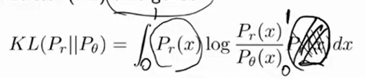
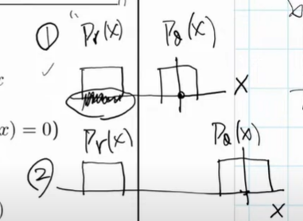
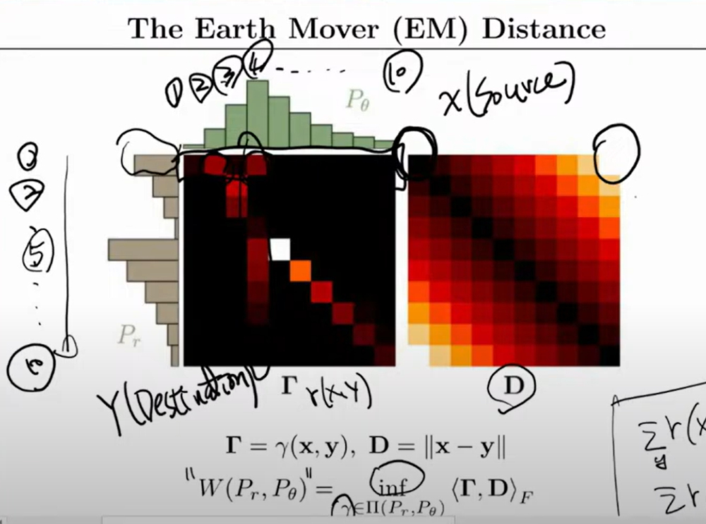
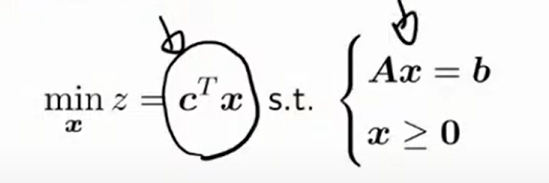

#  GAN
與VAE類似，都希望可以從ground thuth 中學習distribution，GAN的目標是學習一個生成模型，這個模型可以從隨機噪聲中生成與訓練數據相似的樣本。GAN由兩個神經網絡組成：生成器（Generator）和判別器（Discriminator）。生成器負責生成假樣本，而判別器則負責區分真樣本和假樣本。這兩個網絡在訓練過程中互相競爭，最終達到一個平衡點，使得生成器能夠生成非常真實的樣本。
## JS Divergence
Jensen-Shannon Divergence (JSD) 是一種用於衡量兩個概率分佈之間差異的指標。它是Kullback-Leibler Divergence (KLD) 的對稱版本，並且總是有限的。JSD的值範圍在0到1之間，其中0表示兩個分佈完全相同，1表示兩個分佈完全不同。
## KL Divergence
KL Divergence（Kullback-Leibler Divergence）是一種用於衡量兩個概率分佈之間差異的指標。它是非對稱的，並且在某些情況下可能無窮大。KL Divergence的值範圍從0到無窮大，其中0表示兩個分佈完全相同，無窮大表示兩個分佈完全不同。
## GAN問題
### gradient vanishing
使用discriminator來學習分佈，並計算loss，但前期的generator生成的樣本與真實樣本差異很大，導致discriminator的loss會很小，甚至為0，這樣的gradient導致無法更新generator。
### mode collapse
generator學習到一個模式，例如只會生成同一張圖，這樣discriminator也分不出來，導致生成的樣本都很相似，無法生成多樣化的樣本。
### 使用KL Divergence or js divergence
KL Divergence在兩個分布不相交時，會導致loss無窮大，無論分布是差很多或是極度接近，loss都會很大，這樣會導致generator無法學習到有用的東西。
數學版:由於積分時的區間完全不同P 係打是0，因此KL Divergence分母為0，js divergence則會變成log2，永遠常數。

# WGAN(wasserstein GAN)
## Wasserstein distance
### Earth Mover's Distance (EMD)
可以想像為搬移房子中的箱子(一個Distribution)，將箱子從一個地方搬到另一個地方所需的最小工作量。這個工作量可以用來衡量兩個分佈之間的距離。

gamma(x,y)意思為從x到y的搬運量，這個gamma(x,y)是隨著x,y的變化而變化的，這個gamma(x,y)可以看作是一個函數，這個函數的值越大，表示從x到y的搬運量越大。
D|X-Y|=X,Y房子的距離
左圖是amma(x,y)，表示搬運量
右圖是D|X-Y|，表示房子之間的距離
#### 如何實現
Linear programming: 

C為||X-Y||

# 摘要
- WGAN有ge有generator與discriminator兩個網路，generator負責生成圖片，discriminator負責評價圖片
- generator會生成圖片，discriminator會評價圖片，generator會根據discriminator的評價來更新自己的參數
- generator輸入一組隨機噪聲，生成一張圖片，過程不會看過真實圖片
- discriminator設計原理根據Wasserstein distance設計，計算生成與真實圖片的分布距離，但計算複雜，所以使用神經網路模擬1-Lipschitz 函數，估算 Wasserstein 距離

