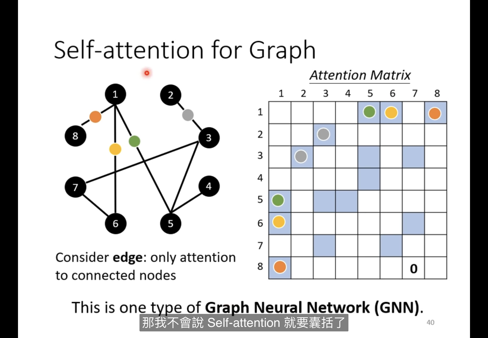

# 機器學習

輸出為數值叫regression

輸出選擇classification

structured learning(創造性學習)

---

課堂一

# 名詞定義

## Model

---

liner model 線性模型，可為多元或一般現行模型

gradient descent 梯度下降法，找出最佳參數的一種方法

function ex: y=b+wx

b=Bias

w=Weight

learning rate 學習率

hyper parameters 模型訓練中需要自己設的數值(ex:learning rate)

model bias 模型本身的限制 如function限制

update更新參數

batch 在optimization時將全部的參數分成小組，一小組為一batch，做完1batch update一次

epoch 做完全部的batch叫1epoch

model complexity 模型複雜度，係搭的多寡

model bias 模型本身的限制

---

## function

---

Piecewise Linear 由多個直線所組成的摺線

## Loss

---

loss is a function of parameters，輸入各種可能的b,w，並對比預測結果與實際label的差距(e)

### **MAE**

mean absolute error (預測結果和實際相減後**取絕對值**，最後將所有e相加取平均)

### MSE

mean square error (預測結果和實際相減後**平方**，最後將所有e相加取平均)

### cross_entropy

計算機率使用

# 課堂一 : 機器學習訓練三步驟

## Step1:function with unknow

---

### define a function

**Activation function** ex:sigmoid,ReLU

**用下方sigmoid function逼近上方hard sigmoid function** 

**ReLU較sigmiod好**

## Step2:define loss from train data

---

## Step3:optimization (最佳化)

### 方法:gradient descent梯度下降法

[PyTorch](MachineLearning_source/PyTorch%20f7d1f2c9f16a413aabd224168d464ade.md)

[Homework-regression](MachineLearning_source/Homework-regression%207feb0271a108438fb1fb741d6791dcb1.md)

# 課堂二 : 優化模型

---

## 檢查training data

### 1.model bias

模型過於簡單

### 2.optimization不佳

 選擇到效果不佳的優化器

<aside>
➡️ 解決方法:

使用簡單的model訊練，比較training 的loss，若有彈性模型loss高，則為optimization

issue

可先使用簡單模型，ex:SVM

</aside>

### 3.training data loss小，testing data loss大→overfitting

越有彈性的model，越可能overfitting

<aside>
➡️ 解決方法

1.使用更多的訓練資料

ex:影像辨識使用 data augmentataion

2.使用有限制的model

減少神經元數量

</aside>

## N-fold cross vaildation

## Optimization優化

若訓練遇上gradient變成0但卻不是在global minima

ex:local minima 和saddle point 斜率為0，卻不是最佳解

<aside>
➡️ **Hession**

用hession 判斷是local minima 或saddle point

hession 的eigen value ，有正有負→saddle point ，皆正→local minima。

計算量極大，**實務上通常不採用**

</aside>

**提高模型維度**，將減少local minima的出現

## Batch

大batch size VS 小batch size

大batch，代表進行一次update會經過更多次計算，更新穩定度較高，且考慮平行處理的問題後，運算度也較小batch size快

小batch，代表進行一次update會經過更少次計算，更新穩定度較低(noise)，且考慮平行處理的問題後，運算度也較大batch size慢

由於小batch update次數更多，每計算下一個batch的loss，皆使用上次更新的新參數，較不容易因為一個loss function被不斷使用，落入local minima的問題

**大batch size的準確度反而越差**

對比兩個model，在其他條件相同的情形下，連training loss都趨近相同，使用大batch在testing得到的loss越大，小batch的到的testing loss 較低

總結大小batch

## Momentum

momentum是指在進行gradient descent 時考慮前一次的update方向，藉由增加上一次的動量，避免落入local minima

## Conclusion

## Adaptive Learning rate

Learning rate 太大，造成無法進入minima，在峽谷兩側震盪 

### RMS Prop

一種透過gradient調整learning rate 的方法，若error surface較陡，則降低learning rate，避免在error surface中的峽谷震盪，反之提高learning rate，增加學習速度。

### Adam (optimizer)

採用RMS Prop並加上Momentum機制的優化器。

### learning rate scheduling

使用上述的方式會如左圖，訓練到後期後會因為前幾次的gradient皆小，累積一步很大，不小心跳出，使用learning rate decay的方法，讓learning rate隨時間降低，避免跳出，如右圖效果。

### Warm up

**進化後的optimization**

**gradient descent & various improvements**

# Claffication

soft max 

將任何數值計算成0~1之間

[CNN](MachineLearning_source/CNN%20aed4da7f9db445398fbaff6bc4899376.md)

# Self attention

將文字變為向量

1. [**one](http://1.one)_hot encoding**

將一個特徵變為一維向量，有幾個字就幾個維度

1. **word embedding**

將相近的詞彙歸在相近的向量

---

## N to N(sequence labeling)

若將saw當作輸入，一定會輸出相同的結果，因此考慮前後組成window，透果考慮前後，得道不同結果，

### self attention

將特徵輸入到self attention，attention是考慮全文後輸出的結果，在輸出一次特徵，後再輸入fc，fc便可得到考慮全文的特徵

---

1**.輸出a1時，找到a系列中和a1相關的**

比較兩特徵的alpha值，alpha產生方式如下

dot_product 將兩個特徵分別做矩陣計算，在做dot_product得到alpha。(較常用)

additive 將兩特徵做矩陣計算，相加後輸入Activation function再到transform最後輸出

2.將a系列呈上w矩陣，得到q1與k系列，透過q，k得到alpha值

3.將alpha進行soft max計算。得到alpha’，同時也會計算a1和自己的alpha值(已得到a系列和自身的相關性)

4.將w*a系列得到v，再將v與alpha值相乘，得到最終b，可以發現若兩個特徵相關性較大，得到b會越接近那個特徵的值。

### multi-head self-attention

## Position encoding

將a加入e作為位置資訊

e可為hand-crafted或學習而來，尚待研究

**truncated attention** 不須慘考整個句子的self-attention，適用於語音辨識等資料量極大之用法。

CNN也可看作一種self-attention，原本的CNN為一種手動定義注意區域的self-attention（receptive field），但可以換一種手法，透過學習的方法決定attention的數值為何，模型的彈性會增加，但也需要更多的訓練資料。

在訓練資料量超過100M時，使用self-attention結果會比一般CNN好

### RNN vs self-attention

RNN將前一次輸出作為下一次的輸入，雖然有考慮到句子中的其他特徵，但針對距離較遠的特徵，影響力不高，self-attention就沒有這個問題，它可以考慮整組的相關性

Self-attention for graph

graph中可以直接注意有相連的edge，產生的表格如右方

[Kaggle Digit_recognize](MachineLearning_source/Kaggle%20Digit_recognize%20b61e87b4257444e7bc91d1e61cf83de2.md)

# Normalization

將所有feature的某個參數做運算，將數值調整在-1~1之間

Normalization 放在Activation function 前後都可以

normalization需考慮到整個訓練資料的input，太大了，因此使用batch normalization每次normalization考慮一個batch的input。

testing 時batch normalization會依在training運算時得到的u做運算

# **Transformer**

seq2seq讓機器自己決定輸出的數量

文法剖析

## seq2seq

### encorder

encorder內部可能包含許多block，一個block可能包含一組self-attention及fc

### 原始Transformer中一個block的過程

1.做self-attention

2.做residual(output加上input)

3.做layer norm(做單一feature的Normalization)

4.進入fc

5.輸出和輸入做residual

6.做layer norm

[7.](http://7.tj)輸出

有比原始架構更好的設計(右)

### decorder

self-attention→masked self-attention

每次輸出只能看前面的，無法看後面，因為還沒生出來

decorder在做輸出時，類似計算所有文字為下一個輸出的可能性，依語言不同，輸出字詞可能性表的大小也不同，另外加一個end代表輸出結束的可能性

## non-autoregressive (NAT)  vs autoregressive (AT)

一步一步生成(用前一次輸出當輸入)VS一次生成(用begin進去，1.先train一個生字數的模型，2.生到跑出end為止)，**NAT可平行處理，更快**

### encoder to decoder

將decoder的輸出和encoder的輸出做self-attention和weighter sum 

## Training

### teacher forcing

訓練decoder時，都使用正確答案作為輸入

### copy mechanism

產生文字時，針對特殊詞彙，只需做複製的動作即可

相關技術:pointer network copy network

## 

### greedy decoding

或許一開始選擇較弱的分數，後面能得到更好的

## beam search

這項技術用於選擇總體最佳，不是局部最佳

若有明確答案，較不需創造力時beam search較適合

### exposure bias

decoder在訓練時input一定是正確的，但實際運作是使用生成的輸出，可能會一步錯步步錯，因此使用scheduled sampling在訓練時故意加上錯誤資料。

# **Reinforcement Learning強化式學習 RL**

[**Reinforcement Learning強化式學習**](MachineLearning_source/Reinforcement%20Learning%E5%BC%B7%E5%8C%96%E5%BC%8F%E5%AD%B8%E7%BF%92%2085b2a60104ef48aa814cc34675b5e565.md)