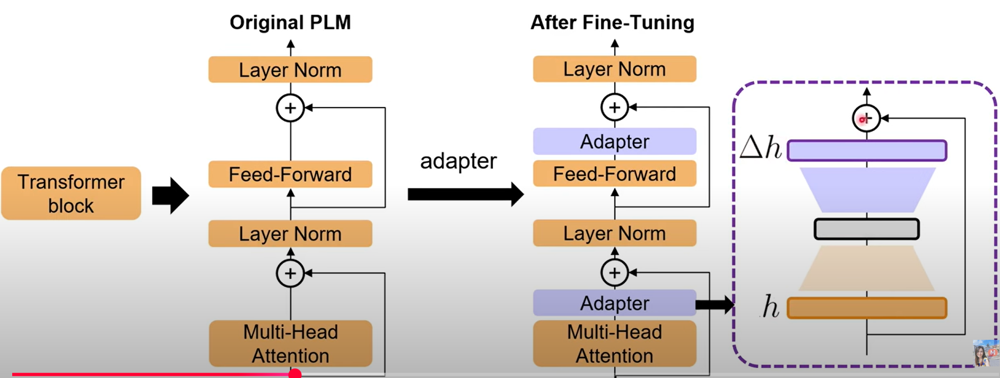
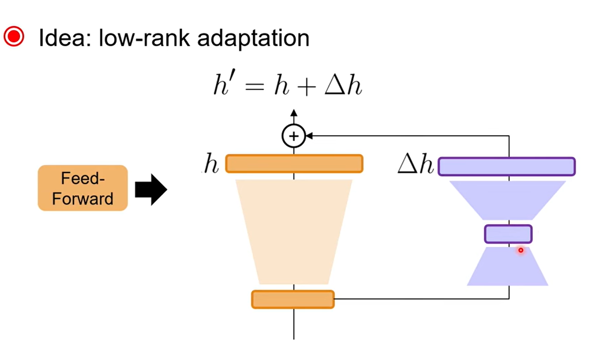

# PEFT
## WHY PEFT
- 大多人工智慧研究以accuracy評估結果，較不注重efficiency
- 模型越來越大，提升accuracy所需資源越多，降低efficiency
## HOW PEFT
基於已經訓練完成的架構(橘色)，在傳遞過程加入新層(紫色adapter)。
原本的model可能是通用的語言模型，透過新的資料訓練紫色部分(adapter)，提升模型在特定領域的能力。

## benefit
- adapter可以插拔，在不同環境用不同的adapter
- 相比fine-tuning不會train壞原本的參數，robusticness、storage-efficiency
# LoRA
- 將部分層進行額外運算，使用bottleneck架構，將低訓練運算成本。

## LoRA result
結果顯示，LoRA可以在相較極低的額外訓練參數下，達到接近甚至超越重train一個大模型的效果。
