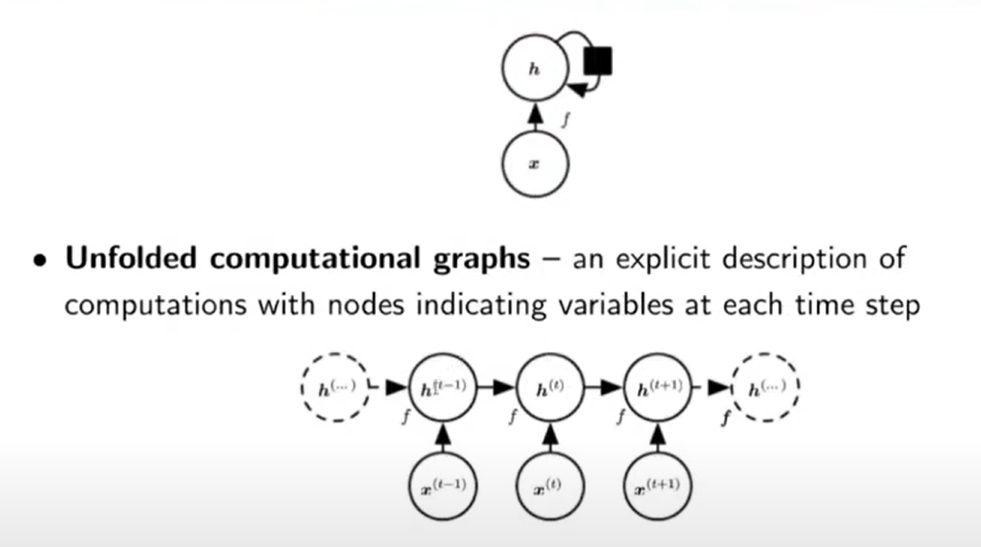
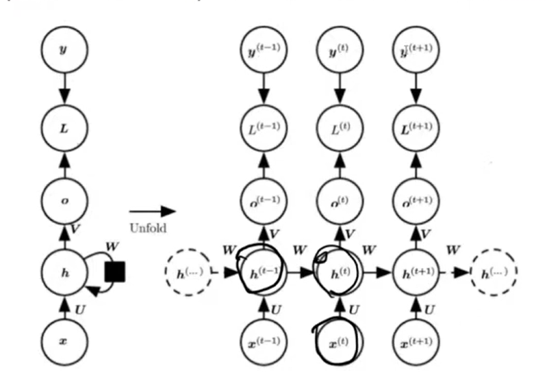
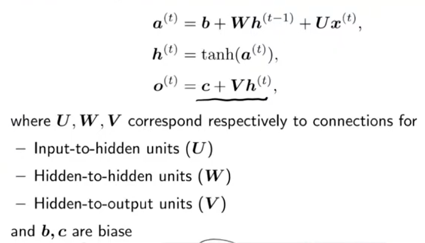

# RNN
用於處理序列相關的神經網路，如下圖，網路會將上一個時間點的計算輸出當作下一個時間點的輸入，與這次的輸入一同當作參數。

如下圖，x為輸入，h為model，o為輸出，a為active function，l為loss，y為ground truth，每個h會同時參考這次的x和上次的h。
注意:h要變成o還有其他計算，h不能直接當輸出，而下圖的o(t-1)其實不影響下次的計算，在某些任務不合理，如:翻譯，翻譯不考慮前一次的輸出很怪，因此在不同任務需要改網路架構。

## backpropagation through time (BPTT)
BPTT是RNN的反向傳播，將時間展開，將每個時間點的計算都當作一層來進行反向傳播。
如同下圖，因為h輸出會被兩個地方使用，需要分別計算gradient 

## vanishing and exploding gradient
簡單來說，當網路越多層，參考的時間越長，之前的參數的影響力會因為不斷與w相乘，變得超級小或超級大，導致與這次的input比例失衡，這就是梯度消失或爆炸。
但事實上，梯度爆炸較不會發生，因為每次forward都會有activation 會限制數值的大小，在back propagation時，若gradient太大，可以把它視為一個方向就好，透過固定的步長來進行更新，避免跳出太多。
但消失是有可能的，是較嚴重的問題，因為gradient趨近0，會導致網路無法更新。

## hw 
wiki: matrix multiplication,在看youtube，可以知道1a 1b 如何計算2a 2b
ABC都是model parameter
B可以理解為input gate，C可以理解為output gate，