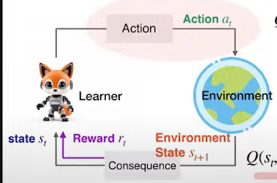
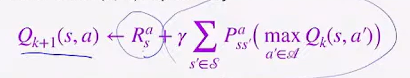
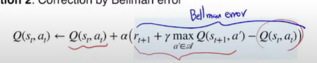

# Reinforcement learning
## on-policy vs off-policy
- on-policy: 每次更新資料後，重新收集資料，因此agent所做的決定會直接與environment互動，並根據這些互動來更新策略。
- off-policy: 每次更新資料後，使用舊資料(資料已經準備好，不需要一遍train一遍收集資料)，
  agent所做的決定不會直接與environment互動，而是使用舊資料來更新策略，agent從其他agent與其他環境互動學習。
## Q-learning

Q-learning是強化學習中的一種方法，它通過學習狀態-行動值函數Q(s, a)來評估每個狀態s下採取行動a的價值。
Q-value的更新公式如下：

1. 透過sample的方式計算reward，並根據權重分配，參考這一步與前幾步，做為Q-value的更新。
2. bellman error: Q-value的更新是基於當前狀態s和行動a的獎勵r，以及下一狀態s'的最大Q-value。
   
## Double Q-learning
### overestimation bias
- Q-learning的Q-value更新公式中，使用了max操作來選擇下一狀態s'，導致
  Q-value的估計可能會偏高，這種現象稱為overestimation bias。
- 解法:double estimator
  - 使用兩個Q-value函數來估計Q-value，分別為Q1和Q2，然後取它們的平均值來更新Q-value。
  - 這樣可以減少overestimation bias的影響，並提高學習的穩定性。
 double Q-learning便是為此而生
## value based
由於環境過於複雜，無法使用q-table紀錄所有情況
### deep Q-learning 
#### replay buffer
- 儲存過去的經驗，並隨機抽取一部分來進行訓練，可重複使用過去的經驗。
- 如果直接用 agent 連續走的資料來訓練，這些資料是**時間相關（highly correlated）**的，容易讓神經網路陷入不穩定甚至發散。
#### target network
- 使用兩個網路，一個是主網路（online network），另一個是目標網路（target network）。
- target network可能很少更新，maybe每1000步更新一次，這樣可以減少網路的變化，讓學習更穩定。(避免陷入短期震盪)
- 