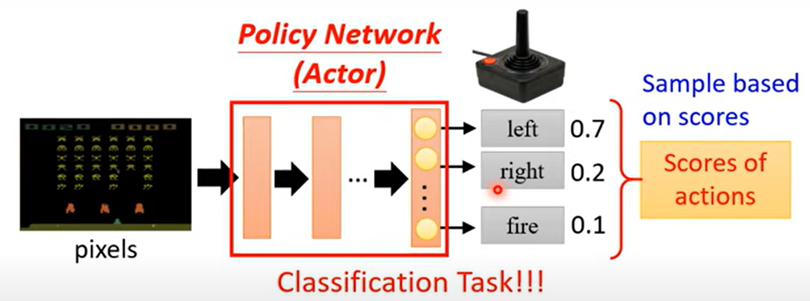

# Reinforcement Learning強化式學習

## Step1:function with unknow

network

output:為數值，通常當作執行該指令的機率，不是單純執行最大值。

## Step2:define loss

total reward:整回遊戲的得分

## Step3:Optimization

Optimization和一般神經網路的Optimization不同

# Policy Gradient

## v0

若簡單因得分可得到獎勵，會出現短視近利的模型。

ex:shoot:+1 move +0;→只會shoot

因此:

## v1

### cumulated reward

a1動作得分取決於a1以後所有reward總和

很後面的獎勵不一定是因為a1這個指令，因此

### v2

加入距離權重，減弱距離越遠的得分效益，增強較近動作的效益。

### v3

行為好壞是相對，同時減去baseline，使reward有正有負。

---

RL需每次更新資料後再重新收集資料，因此花時間

---

### on-policy vs off-policy

- on-policy: 每次更新資料後，重新收集資料，因此agent所做的決定會直接與environment互動，並根據這些互動來更新策略。
- off-policy: 每次更新資料後，使用舊資料(資料已經準備好，不需要一遍train一遍收集資料)，
  agent所做的決定不會直接與environment互動，而是使用舊資料來更新策略，agent從其他agent與其他環境互動學習。

---

為什麼需要使用隨機性，採取指令，若每次只選最大值，不加隨機，則不可能學習到新指令

# Actor-Critic

該架構分為Actor與Critic

Actor:輸出動作數值，接著以機率方式決定下一步動作。

Critic:為該動作打分數，以期望值方式判斷是否為一個好動作。

critic :評估actor好壞

critic function :得到執行這次指令的期望值

**Monte-Carlo(MC)**

這到得到的cumulated reward G，下次計算可以估算期望值應該要達到G

**Temporal-difference(TD)approach**

僅使用rt與下一個環境st+1，

## MC vs TD

MC:單純使用cumulated reward

TD :基於cumulated reward，使用rt與下一個環境st+1計算

## V3.5

將V3中的baseline改為critic function

## v4

### **Advantage Actor-Critic**

執行at得到rt，加上執行後的st+1之平均期望，減去這次的平均期望，

## Tip

**Actor和Critic淺層網路可以共用參數**

# Sparce Reward獎勵不易取得的情況

## reward shaping提供額外獎勵

加入更多獎懲制度，不僅是遊戲本身的制度

### courisity

加入好奇心，鼓勵機器接觸新事物ex:馬力歐，向右移動

## No reward

### Imitation Learning

環境不回給actor reward，學習專家，behavior cloning，適用於沒有獎勵的環境，或規則太難制定

EX自動駕駛，IROBOT

## **Inverse Reinforcement Learning(IRL)**

透過expert與環境，學出reward function，再透過一般RL，依照reward function學習

