# self supervised learning
## 簡介

self supervised learning沒有label資料，屬於unsupervised learning的一種，但訓練過程會將資料轉換成有label的資料，再進行訓練。
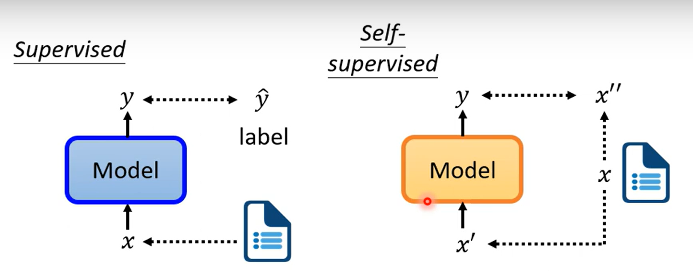
## BERT
### BERT訓練機制
#### masking 
訓練過程將文字隨機蓋牌，使用兩種方式蓋牌
1. MASK: 將文字蓋成[MASK]
2. Ramdom: 將文字蓋成隨機字
訓練目標為最小化蓋牌後的文字與原始文字的cross entropy

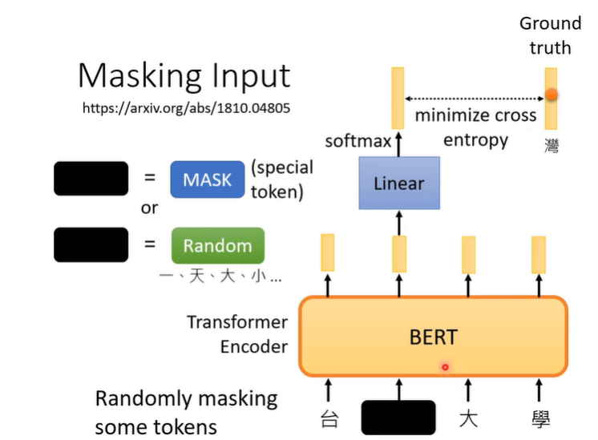
#### next sentence prediction
有論文指出該機制對BERT沒用
該機制為只看CLS對應的輸出，並透過一個全連接層判斷下一句是YES或NO，目的為分辨兩句話是否連接
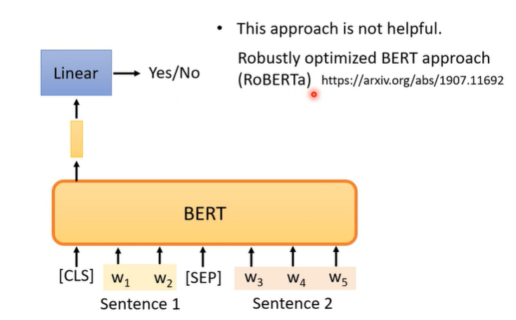

### BERT應用情境
#### sequence to class
使用BERT的Pre-train模型，並修改cls的全連接層，將輸出轉換成分類，該方法需要標註句子的class才能優化linear layer
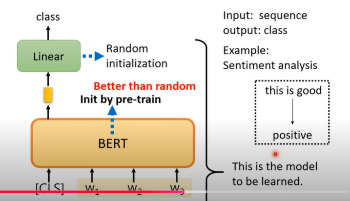
#### sequence to sequence(same length)
例如:詞性標註(POS)
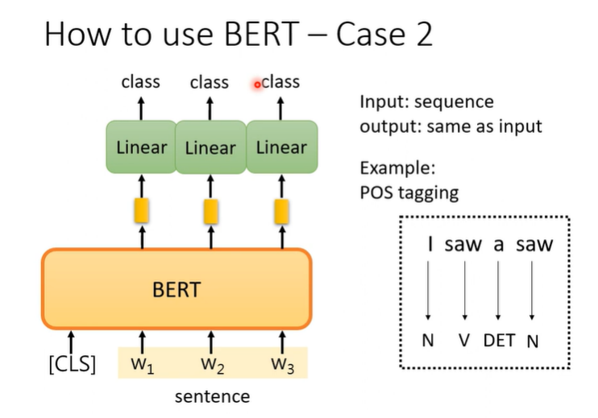

#### 2 sequence to class
例如:提供兩個前提句子，判斷是否為矛盾，文章立場分析。
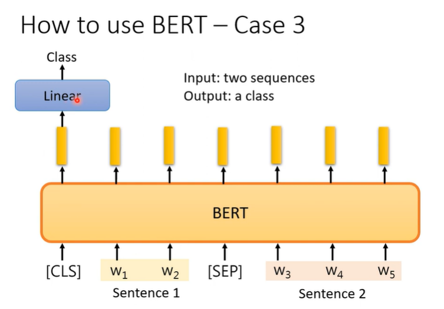
#### QA
例如:問答系統
輸入文章與問題，輸出兩個整數，亦即答案的起始與結束在文章中的位置
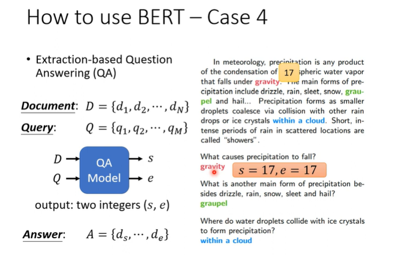
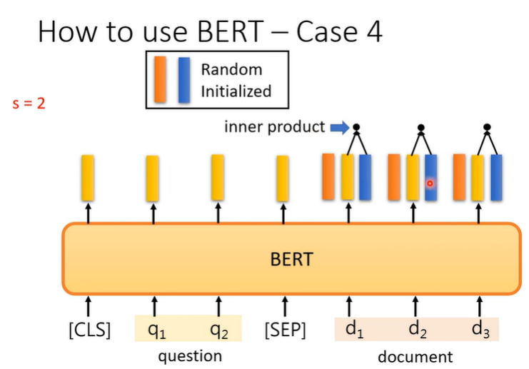

### why does BERT work?
#### enbedding
分別計算兩句子的"果"字，可以發現根據前後文不同，BERT輸出的向量也不同
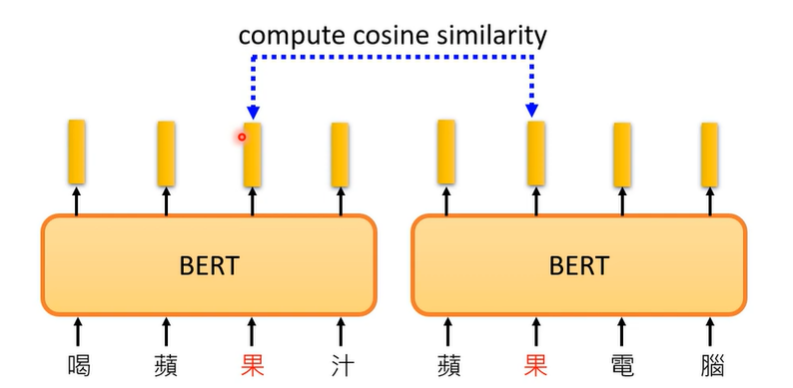
#### 推論
根據上方可以發現，字的向量會參考前後文，引此可以推論BERT可以根據前後文推論出該字的意義，是word enbedding的進階版

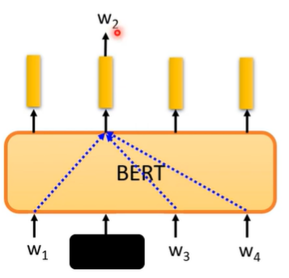
將蛋白質、DNA、音樂轉換為文字，透過BERT訓練分類模型
，表現仍比其他模型好，推論即使該文字中間沒有人和邏輯，BERT也可以根據前後文推論出該文字的意義，這樣BERT真的是理解文字嗎? 
ANS:2022仍無解，可能是BERT的參數適合任何大型模型任務
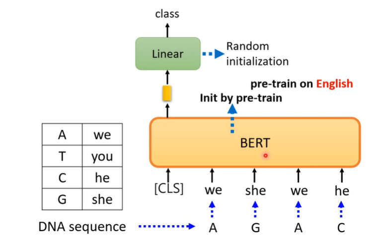
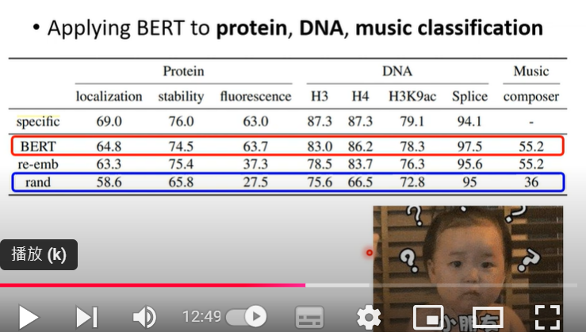

### multi Language BERT
使用純英文的fine tune模型，可以直接使用在其他語言， 效果不錯
推論:使用104種語言的pre-train模型，可以將不同語言，意思相同的字enbedding在一起
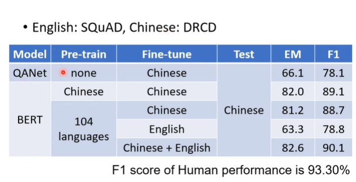
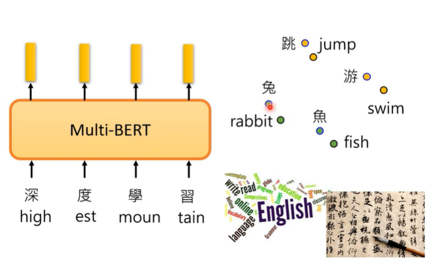
研究發現使用更多資料量對於模型效果極大幫助，200k vs 1000k
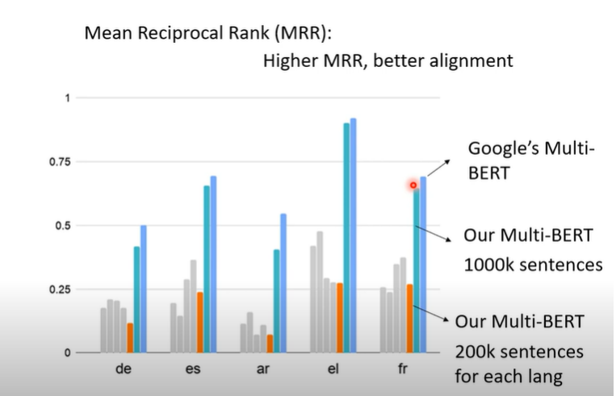
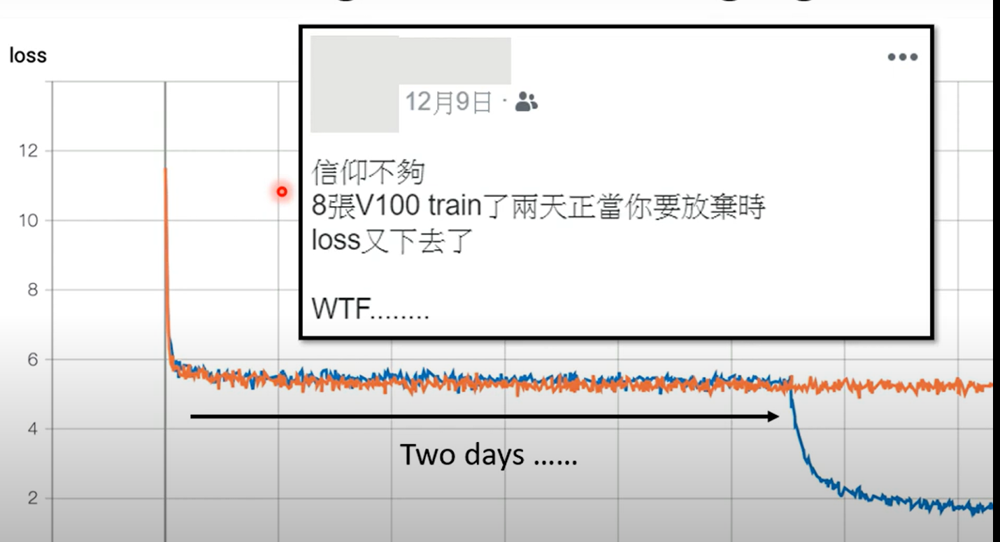
#### 語言
嘗試計算中文與英文enbedding後的總向量差距，發現若將英文的enbedding加上語言差距向量後，可以得到近似中文的enbedding
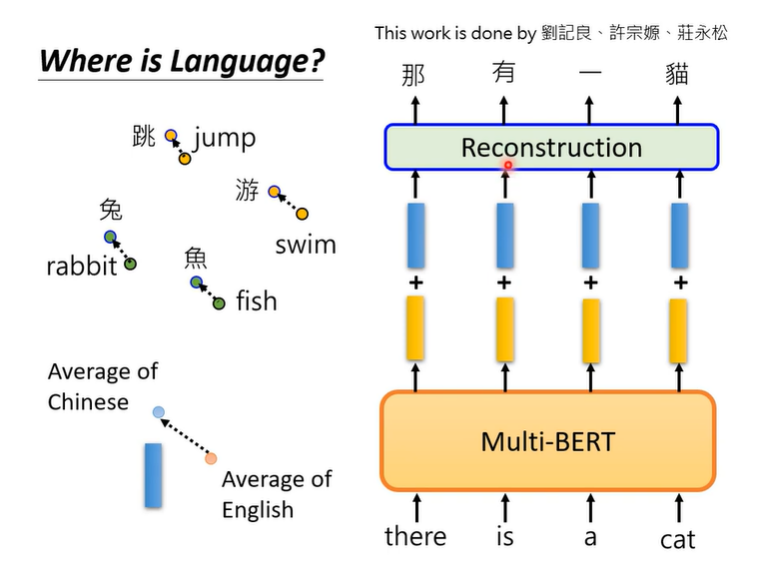
### 評估BERT模型
GLUE: General Language Understanding Evaluation是個用以評估NLP模型的benchmark，有9個任務，會分別將模型pre-train後，在fine tune到各個任務上，並計算各個任務的分數
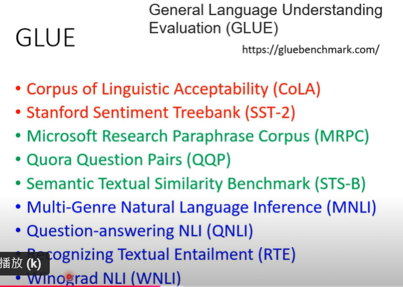
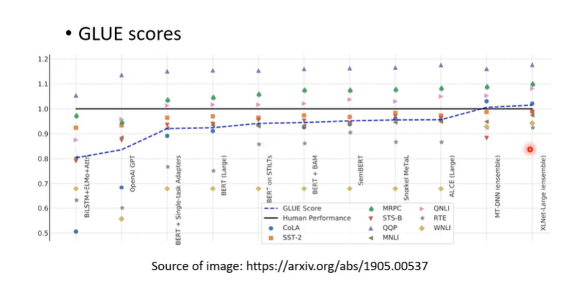
因應模型進步，還有提出了SuperGLUE，是GLUE的升級版，有更多的任務，並且更難
### BERT 的fine tune優勢
scratch: 從頭訓練模型
fine tune: 使用pre-train的模型，再進行訓練
虛線為fine tune的模型，實線為scratch的模型 
 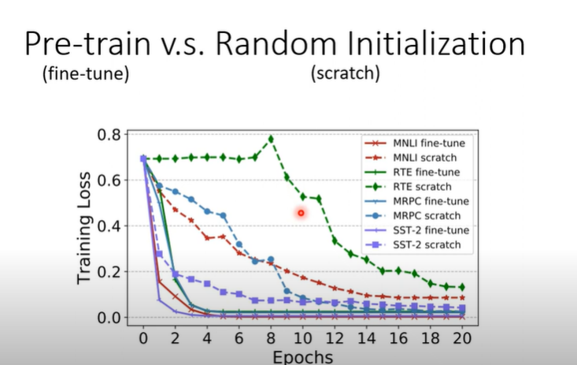
## GPT 
### 簡介
GPT使用tramsformer模型，與BERT不同的是，GPT屬於decoder，BERT屬於encoder
### GPT訓練機制
#### prediction next token
不同於填空題，GPT是預測下一個字，並計算生成字與原始字的cross entropy
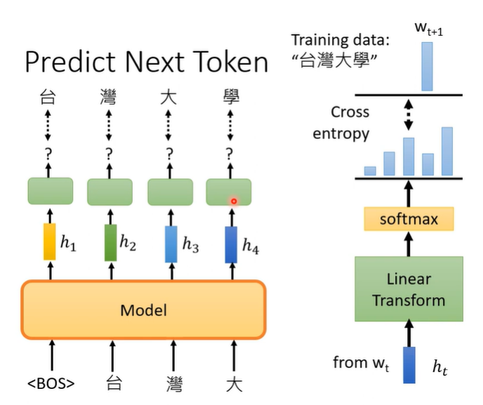
#### learning

### GPT應用情境
應用方式區別:
不使用其他linear layer，直接使用GPT的output
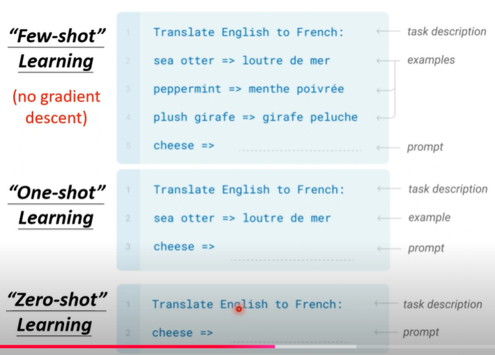