# Transformer
## 過去技術問題
### RNN問題
RNN問題，雖然可以處理序列問題，且輸入可以是非固定大小，但由於需要計算完上一步才能做下一步，不適合平行化處理。
### CNN問題
使用CNN雖可以進行特徵擷取，但若需要使其處理文句，由於文句很長，需要疊很多層才能學習到長距離的關係，這樣會導致計算量過大。而低層的計算又太片面，效果不佳。
## Transformer
### the basic unit of transformer
#### input 
將文字轉為數字，通常使用index方式，ex: apple=1, orange=2, banana=3

#### enbedding layer
將文字轉為向量，向量長度可能為512，而透過計算，將兩相近語意的文字轉為相近的向量，如:apple和orange會被轉為相近的向量。相反的，若兩個字意義不相近，則會被轉為相距較遠的向量，如:apple和car會被轉為相距較遠的向量。
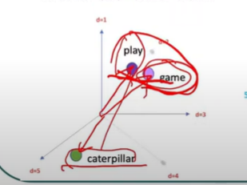
#### positional encoding
原本的enbedding不會考慮文字位置，positional encoding將文字的位置資訊加入到向量中。根據位置不同，使用不同的sin和cos函數來進行編碼。
最終，一個字會分別計算enbedding和positional encoding，並將兩者相加，e0+p0，這樣就可以得到一個字的向量資訊。
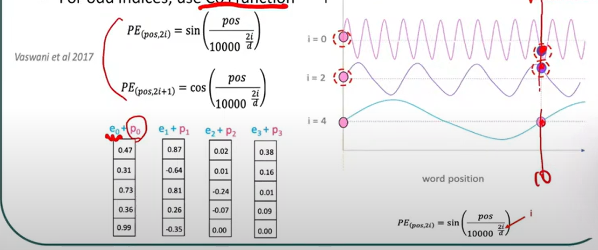

#### attention
##### self-attention
1. ai為ei+pi，ei為enbedding，pi為positional encoding。
2. 分別計算query、key、value。
query為ai乘以wq(矩陣)， 
key為ai乘以wk(矩陣)，
value為ai乘以wv(矩陣)
3. 每個文字會得到q、k、v。各個w是訓練出來的參數。
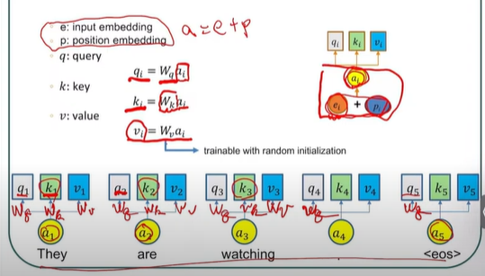
4. 使用Dot-Product計算自己的q和其他文字的k，產生alpha1,1，alpha1,2...。
5. 計算softmax將alpha轉為機率，所有alpha總和為1，該數值便是attention value，可理解為該文字的重要程度加權。
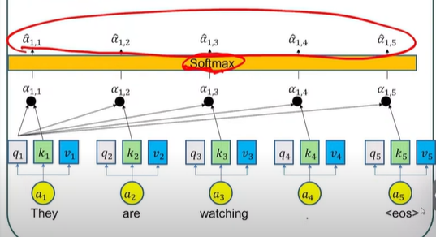
6. 使用alpha head 乘以value，而每個文字都要進行一次這六步的計算，因此每次的輸出都是參考全文的。 
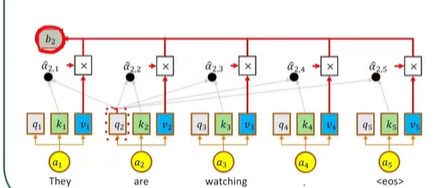
###### how to parallelize
1. 所有的a可看成一個矩陣，因此只需要三個矩陣計算，分別計算wq、wk、wv，便可計算出q、k、v。
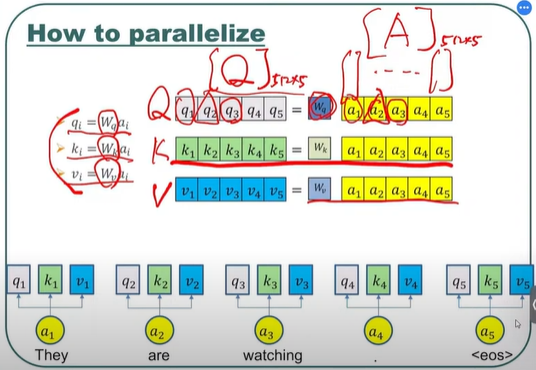
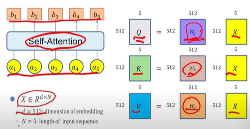
2. alpha計算為一個大k矩陣，乘以大q矩陣，大k矩陣為所有文字的k，大q矩陣為所有文字的q，這樣便可計算出所有文字的alpha。
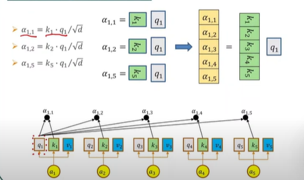
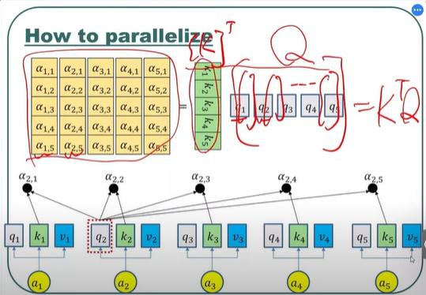
  
3. 最終的b輸出也是一個大矩陣計算
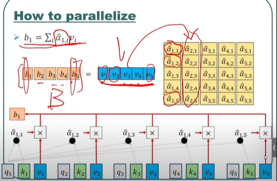
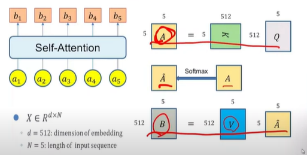

##### multi-head attention 
以2-head為例，分別使用兩個w矩陣，將q、k、v分為兩組。
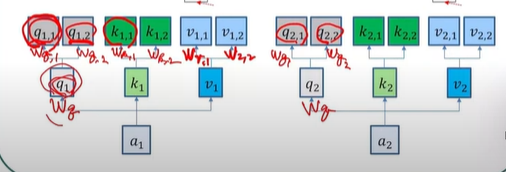
再透過和self-attention一樣的方式計算出兩組的alpha，
並將兩組的b進行concat，最後再乘上w0矩陣。
用以處理更複雜的關係。
### the architecture of transformer
#### encoder
1. encoder的架購包含多個encoder block
2. encoder block疊很多層，用於處理height level information。
3. 每個encoder block包含兩個主要的計算，分別為multi-head attention和feed forward network。
4. 使用residual connection，將輸入和輸出相加，處理梯度消失問題。
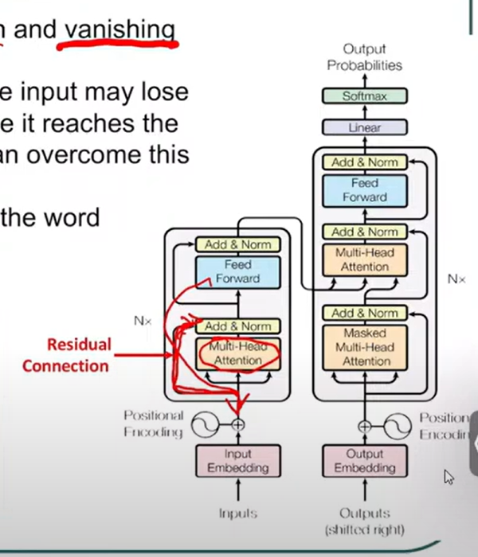
#### decoder
1. decoder和encoder的架構相似，但需要使用masking，遮住後面的文字
2. decoder的輸出會使用到所有encoder的輸出以及decoder之前的輸出。
## models based on transformer
### BERT
是MLM(masked language model)的模型，會隨機將句子中的某些字進行mask，並讓模型預測這些字。
其餘請看self-supervised learning.md
### vision transformer
1. transformer若要使用在影像，每個pixel都要有一組參數，這樣會導致參數量過大。
2. 將影像切個小塊，每個小塊當作input，這樣可以減少參數量，可以想像為把每個文字換成一小張圖。
3. tramsformer使用enbedding向量代表文字，使用pixel的rbg值來代表影像向量。

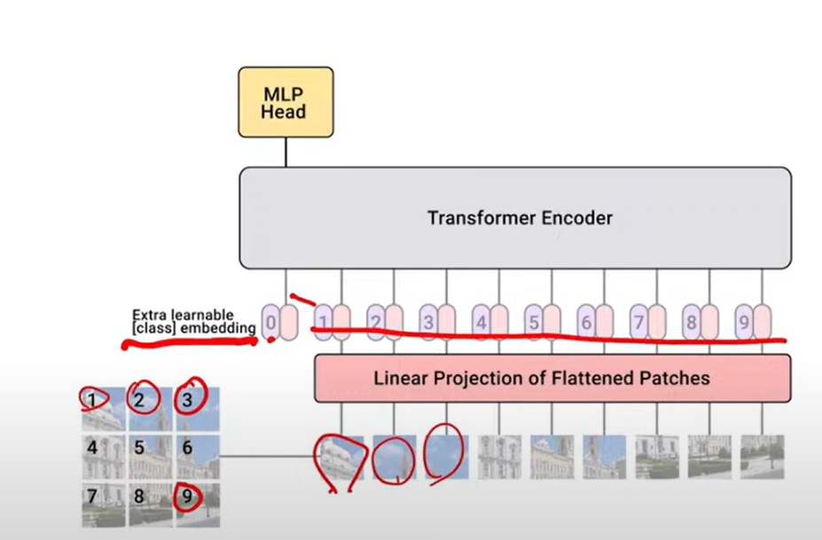